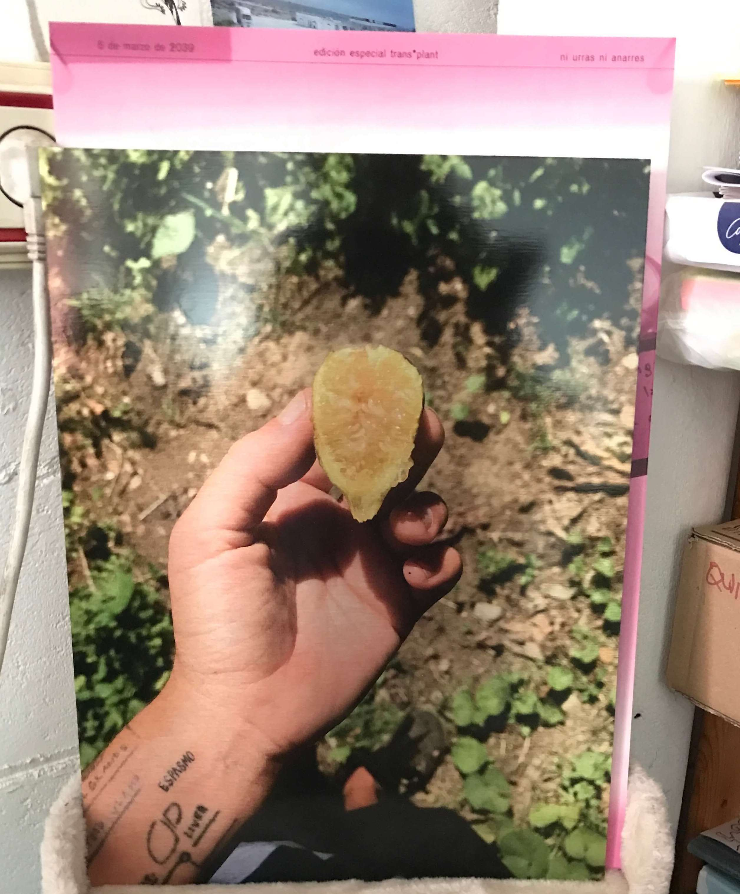

---
hide:
    - toc
---

#

### about me

my name is Stella (she/her), I am a in 1996  born German-Dutch who grew up in Berlin. I am aware of the ongoing environmental changes and climate catastrophes that our societies are confronted with to unprecedented degrees. Therefore, this is the constant background music to my practice.
As a sociologist, artist and architectural thinker, I am convinced that the thorough study of how human and non-human structures learn and unlearn will feed into our understanding of how they are embedded in a global ever-changing environment - and how possible reactions to these changes could look like.

I have learned that exchange and discussion open up (new) possibilities for seeing and thinking. Recognizing and developing discourses
together promotes heterogeneous coexistences. For me, creating social spaces means imagining collective solutions to global challenges.

**[my website](https://stella-dikmans.github.io/MDEF/)**
