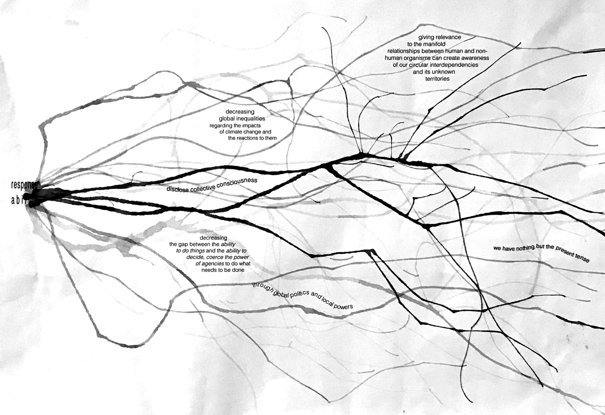

---
hide:
    - toc
---
#

as a pacifist I am against any kind of violence.
so let me rephrase: *I work against global inequalities and for an equal distribution of the impacts of climate change and expansive responses to them.*

climate change affects differently in different areas of the world. I am a fan of differences; I don’t believe with homogeneity we will get anywhere. yet there is a clear distinction between difference and inequality. that the effects of climate change lead to threat and death of some human and non-human organisms, and to prosperity and luxury to others is not difference but the result of inequal distribution of resource-access and -consumption, knowledge-acquisition and -production, available adaptation- and coping-mechanisms, -strategies, -tools and so on.

I am convinced that there are enough resources (human-brains that think, potent materials to be used responsibly, already developed, and tested mechanisms and strategies that will function as tools…) to prevent the effects of climate change leading to death of any human and non-human organisms. but instead of using the power that some have (because of access to these resources) to establish equally safe and thriving places everywhere, the effects of climate change are becoming more extreme.

why is that so ?  I was educated as a sociologist and an artist; I don’t dare to give an answer that would suffice the complexity of human behavior.
but there are two ways I can approach the question:

firstly, through what I experience myself: when things are unknown, they seem to be more difficult to the extent that we often ignore them. what we don’t know, seems vast and impossible to access. what we do know becomes familiar and easy to handle. one example: getting to know your ways. in a new city, we figure out one way to get to the metro when we arrive. we will use that way from now on. there are thousands of ways to get to the station, yet we are likely to stick to the one we know. because it feels the fastest to us. if we tried another way, we would experience it as longer, even though it might technically be shorter. that is because our brains like to know/ have experienced things, and it is easily overwhelmed by things we do not know/ have not experienced.  
similarly, we face climate change. we easily ignore what we have not experienced and cling to the ways and techniques we have experienced. in an individualist, capitalist world like the one I was raised and socialized in, this has fatal consequences.

secondly, I can approach the question through the thoughts of previous thinkers. according to Zygmunt Bauman, power is the ability to have things done and politics is the ability to decide which things are to be done. his analysis of contemporaneity conclude that whereas earlier the abilities of power and politics were united in one place (nation-state government), nowadays, power has evaporated into global cyber-worlds while politics remained on local, nation-state levels. politics therefor failed to emigrate into the space of flows that Manuel Castells describes as the digital turn allowing distant synchronous, real-time interactions.
following this line of theory, the major source of contemporary fear is that no one is in control – which can be translated into a fear of the unknown.

we are thus faced with a growing gap between the ability to do things and ability to decide, coerce the power of agencies to do what needs to be done because we are scared to experience the vastness of the unknown. although I am convinced that the overall goal should be to train our brains to become comfortable with the unknown in general, the more immediate result will come from making vastness less big. switching what Bauman has analyzed, establishing global politics and local power.

my practice aims to make climate change affects ‘small’ and handleable on a global scale by making them known. getting comfortable with the thought of not having a somewhere else to throw shit at; to create awareness that its all the same place; that there is only here, only this world with all its differences and human and non-human organisms that are equally worth protecting and thriving.
in the end this has something to do with the notion of relevance. relevance as subjective and relative, determined by its space-time conditions. what do we learn to know and what do we not? what has the relevance to be known/ be experienced? to give relevance to the manifold relationships between human and non-human organisms can create awareness of our circular interdependencies and its unknown territories. the knowledge and resources to distribute the impacts of climate change equally are available in a great variety of storytelling, some of us have also experienced its applications. it is just about making it approachable.

*influences:*

*Anna Tsing, the mushroom at the end of the world https://www.academia.edu/40320405/The_Mushroom_at_the_End_of_the_World_Anna_Tsing (2015), https://www.youtube.com/watch?v=f8MhBwsKdJA (2021), ...*

*Donna Haraway (string figures, speculative fabulation), staying with the trouble,  https://www.dukeupress.edu/staying-with-the-trouble (2016), https://www.youtube.com/watch?v=GrYA7sMQaBQ (2017), https://www.youtube.com/watch?v=zFGXTQnJETg (2016), ...*

*Manuel Castells (space of flows), https://tspace.library.utoronto.ca/bitstream/1807/94355/1/184%20Castells%201991%20The%20Informational%20City.pdf (1991), ...*

*Timothy Morton (dark ecology), all art is ecological, https://books.google.es/books?id=tH8hEAAAQBAJ&printsec=frontcover&dq=timothy+morton+dark+ecology&hl=de&sa=X&redir_esc=y#v=onepage&q=timothy%20morton%20dark%20ecology&f=false (2021), https://iscp-nyc.org/event/timothy-morton-and-you-may-find-yourself-living-in-an-age-of-mass-extinction (2016), ...*

*Ursula Le Guin, art of living on a damaged planet https://www.jstor.org/stable/10.5749/j.ctt1qft070 (2017), https://vimeo.com/388580186 (2014), ...*

*Yuval Noah Harari, sapienship, https://www.ted.com/talks/yuval_noah_harari_the_actual_cost_of_preventing_climate_breakdown (2022), ...*

*Zygmunt Bauman (liquid modernity, power vs. politics, continuous uncertainty), https://www.youtube.com/watch?v=73Nmv-4jvSc (2011), https://www.youtube.com/watch?v=zvfLpptUIh4&t=248s (2010), ...*
