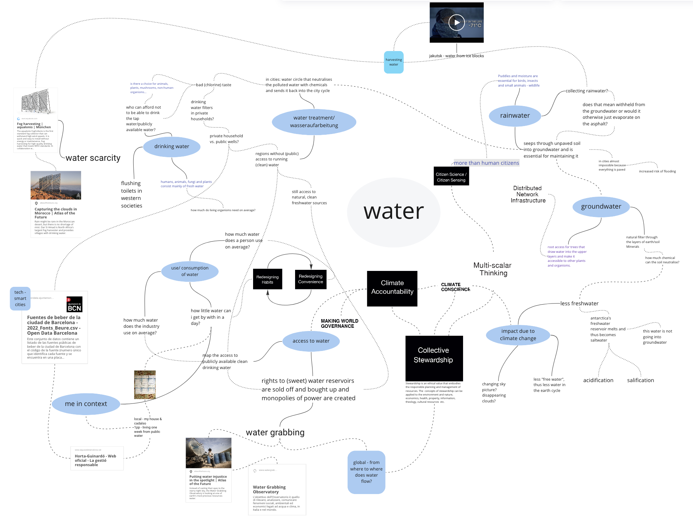

#

## design space 01
*we are in constant becoming.* 

in this design space I centered my topic of interest through which I hope to access my more wider conceptual interests. To engage with my the my broader design space in which I move and hope to have imapact visit **[my weak signal design space](https://stella-dikmans.github.io/distel/term1/aows/aows/)**

my practice seeks for an equal distribution of the impacts of climate change and expansive responses to them by fueling the multiplicity of more-than-human narrations. I want to learn how to design balanced relationships that embody synergies, acknowledging that the interconnected whole is far more than the sum of its parts. this is all the same place, one world with all its differences and human and non-human organisms that are equally worth protecting and thriving. I observe that political discourses are stuck in their monophonic stories and easily lose sight of essential needs such as access to clean air, drinking water, and balanced nutrition. 

when it came to contextualizing myself in my environment, I re-realized my interests with water consumption. the tap water in my house tastes strongly of chlorine and in social events I often find myself talking about the best water-filter to install in sinks or bottles. I am impressed by the large number of public wells in the city. I have taken to bike with my empty bottle, saving weight and just stopping whenever I feel the need to drink. I never lived in a city in which water was so easily available. I remember in Berlin a start-up once tried to convince shops and restaurants to allow people to fill up their bottles with tap water without charging them. I think it failed. is it right that I am impressed by the supply of such basic need? 

my parents took me and my brother camping in nature from an early age. there was no tap, no socket, the nearest well was a 30-minute walk away I remember the sun burning hot on our backs, the five-liter bottles we tossed around on the way to the well, now heavy and full in our hands so that they hurt the insides of our hands. we knew exactly how best to wash ourselves; we found out that the best technique to wash the dishes without soap (at that time natural soaps were not so common) is to scrub with soil and grasses and then just gently rinse with water while brushing your teeth with the same water.  I also remember buying water to drink at the shop. as a very migraine-prone family, my mother always made sure that we didn't run out of drinking water.  yet, for a family of four at 30 degrees in the shade, it was quite a few liters that we would consume in a day - that is, in a week.
I think I had my first culture shock when I was 16, arriving back from a four month stay on the forests near Chiang Mai, Thailand to my parents’ house in Berlin, Germany. I went to the bathroom and realized for the first time in my life that I had been flushing away my excrements with drinking water. and not only that but by throwing soft-washed paper unto the water, I polluted it, so that it meant an enormous effort to filter, clean and treat the water before it could be used again in the tap water system of this city. 
 
## on water
{ align=right }
 

 
