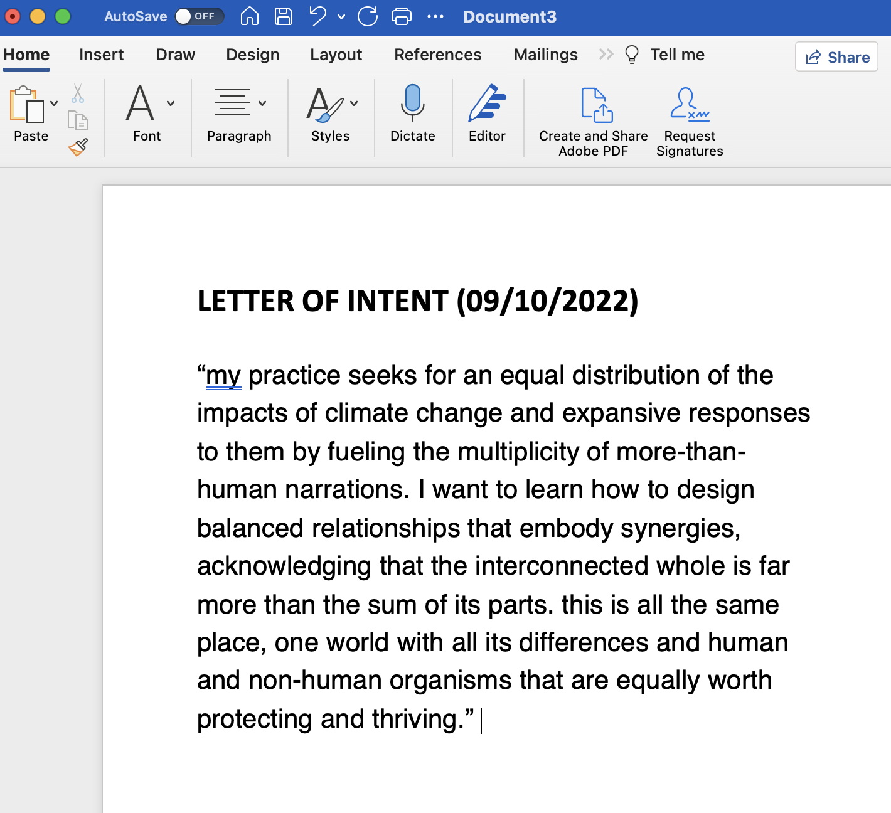
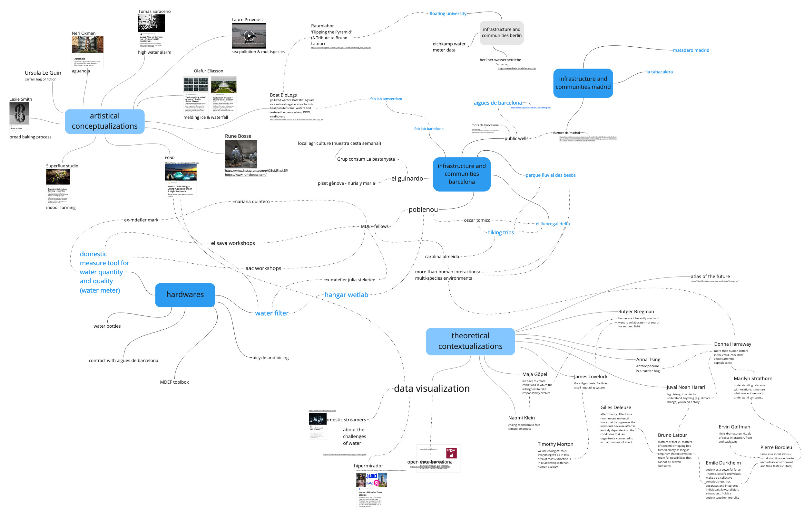
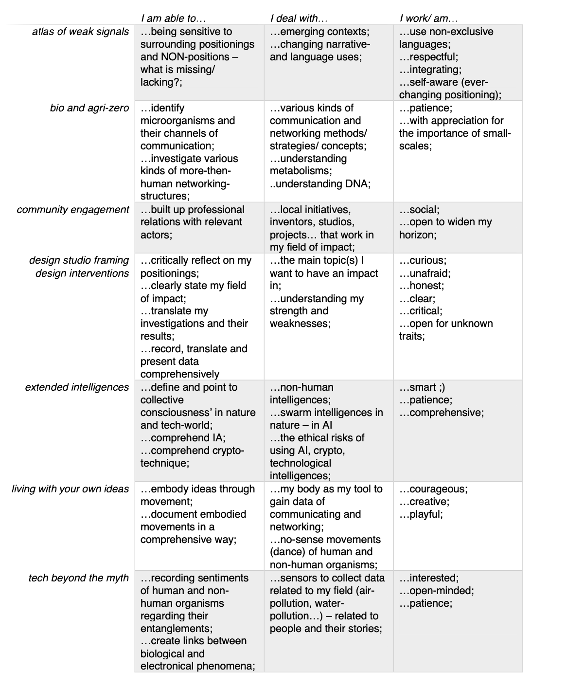

#
##hybrid profiles and work spaces
*we are in constant becoming.*

evolving as a hybrid profile means constantly reflecting on and envisioning my personal developments regarding my professional identity and visions. 
a personal vision is a driving force in designing for the unknown. this vision needs a clear focus, is personal, and is connected to the professional identity. 

what is my design vision? where and how do I see myself designing for (social) worlds in the (near) future? it helped to write a letter of intent, an abstract to my thought world... 

##letter of intent (09/10/2022)

##design vision

*exchanging in hyperconnectivity.*

in contrast to how I imagine private living embedded in immediate, personal contact and hapticity, I envision the field of design as a globally connected space of flows in which knowledge acquisition is distributed and resembles a swarm intelligence. various scientific as well as non-scientific disciplines recognize their interdependencies and through this develop abilities to respond to local changes that depend on global phenomena.
there are global structures and frameworks, developed by the Chtulus of Gaia, to guide (re)actions on various scales, involving and affecting more-than-human beings.

with the help of three parameters and six areas of reflection, I can develop my hybrid profile, my professional identities, the current one and the desired future ones.
parameters: (1) skills, (2) knowledge, (3) attitude. 
areas of reflection: (1) personality traits, (2) personal history, (3) what drives me, (4) what inspires me – in practices and people, (5) what interests me, (6) what I believe in.

after mapping out my departing context atm, I can visualize what path I want to go and imagine what I need to learn on my way. 

##hybrid profile

*being in constant departure.*

##augmented context - my work space

*I only exist in the context in which you perceive me from your context. who am I if not the one you see?*

a context shapes me as a professional in the sense that the physical and virtual access points available to me determine my possibilities for collaboration and creation. 
reflecting on my hyperlocal and hyperconnected design space in which I move physically and virtually, I become aware of what is available to me through the access I already have and what access I still need to expand my sphere of action. 
with the help of four areas of reflection, I can develop my design space, the current one and the desired future ones; augmenting my context.
areas of reflection: (1) hardware – this includes the material and things, (2) infrastructure and communities – this includes people and more-than-human relationships, (3) theoretical contextualization – these include the guiding forces that shape my beliefs (4) artistical conceptualization – this includes the sources of inspiration that shape my practice.

##MDEF trimester plan of expectations

*focusing on (personal) relevancies without flattening (general) relatedness.*

