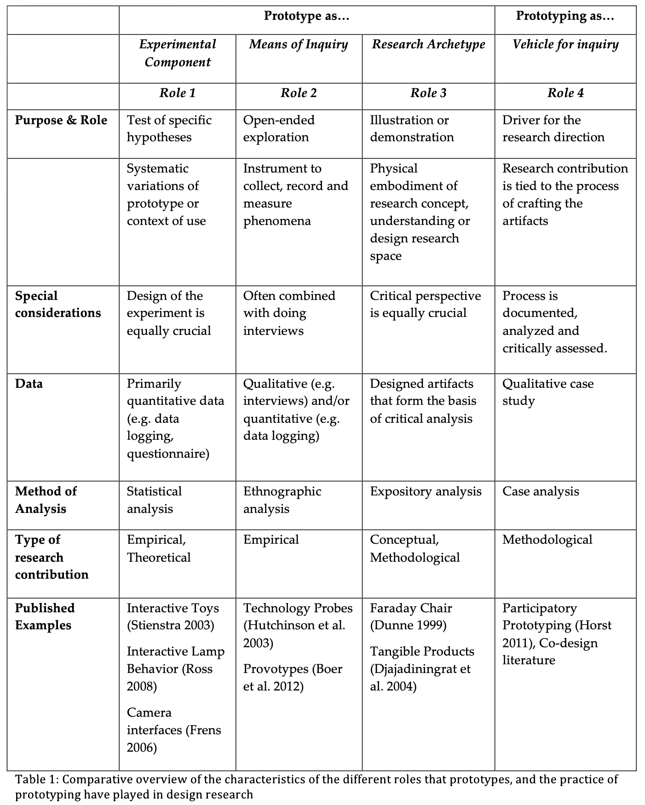

# 
##prototyping

*prototyping as a tool for your design practice; get your hands dirty.*

prototypes can help to capture and visualize data. what role we assign to the prototype is important because the way we prototype will shape our projects and design processes. Oscar Tomico introduced us to four different roles that prototyping can play in design practice and enquiry processes.

(1)    prototype serves as an experimental component: here a hypothesis is tested 

(2)    prototype serves as a means of inquiry: here an open-minded exploration is performed and the pt is the instrument

(3)    prototype serves as a research archetype: here the pt serves as an illustration and demonstration to show possible results of the research

(4)    prototype serves as a directing tool for inquiry: here the making-process (with all involved agents) of the pt is helping to direct the research

*fast scaling and fast failing are important to the design practice as this is what helps to understand the granularity of situational contexts in which a design intervention is thought to have impact.*

##personal experience with these four roles of prototyping

a prototype’s role as a hypothesis tester is in my experience common in scientific and architectural research. at least in social research, we often make up hypothesis and then go on quantitative or qualitative investigations trying to falsify our assumptions. also in architectural design processes, I experienced the theoretical anticipation of certain scenarios and a subsequent practical approach of making small-scale models to test whether the ideas were accurate.
    for my project on unequal access to water (in terms of quantity and quality) I would like to investigate without prior assumptions. but I can imagine that at certain moments it makes sense to focus on a particular hypothesis and its application. this will help to concentrate the research area.

as a mean of inquiry, prototypes were essential to my bachelor-thesis that dealt with the influence of one’s social surrounding on one’s environmental attitude. the qualitative interviews I conducted had a clear guideline, which I adapted depending on the recipient and the situation. I conducted each interview only once and weaved the obtained data into my observations. another social research I implemented was a quantitative survey on the housing situation among art students in Amsterdam. the survey was my tool to obtain the data I was looking for. in both cases, the topic was clear yet there was no outcome assumed.
    to find out how water is consumed by the inhabitants of Barcelona, I can use prototypes of water filters, water measures etc. to obtain relevant data within a framework yet without prior expectations. Furthermore, I can be the prototype myself to observe patterns in water consumption (regarding quantity and quality).

as an archetypal prototype, I once wrote a fictional story about a future in which a virtual object provides the framework for a society that has sterilized themselves to the extent that Earth seems toxic in every sense. 
    building on the data I have received from myself as a prototype, I can also use myself as an archetypal prototype: I can determine the access and the amount of water I have; I can embody what access and consumption looks like in different areas and situational contexts (in Barcelona and beyond), etc..

the last role of prototypes, the one where prototypes serve as vehicles for enquiry, is one that I have probably unconsciously explored a lot. here, the research itself directs the area of exploration. I'm thinking of building fires in nature, cooking when the fridge is empty, sharing beds when there are more people than pillows to sleep on.... here it is the process of making, looking for dry wood under bushes, mixing garlic and honey to make spice, stacking clothes to soften the ground.... All these things lead to observations, to insights that one would never have gained by defining an area of research or asking a question beforehand. the information and interest come while doing, while prototyping ideas.
    I think that this role also is the most interesting to my still very wide and open project. inequalities regarding water access is widely investigated theoretically and explored in many ways through practical interventions. I would like to explore openly and through a collaborative process with people and more-than-human beings what water means, to me, to others, to structures of inequality. 

