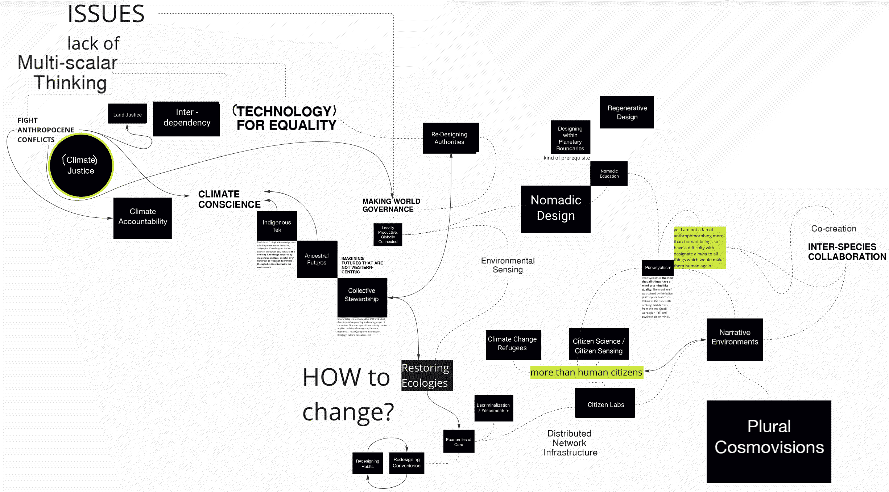
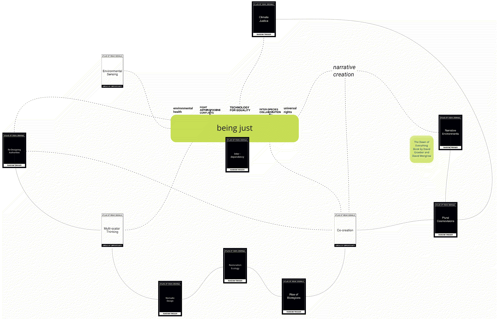

# atlas of weak signals

##design space of weak signals

*looking closely. imagining widely.*

weak signals are indicators to identify a change in the future with little or no impact on the present, but with the potential to lead to the identification of major impact events. they set trends and indicate certain directions and by that draw up future scenarios. investigating weak signals enables a practical approach to navigate and understand possible emerging scenarios. it facilitates seeking opportunities, threats, challenges and shared visions for innovation, policymaking, intervention, research, and business opportunities in the future.

the atlas itself is a card set, a toolkit designed by Mariana Quintero. it provides a structure to design a “space” to move and position oneself in. it considers the complex panorama of our present as well as future challenges and helps to disclose and create opportunities for design interventions.

##personal weak signals and subsequent design space

my weak signals are: *“fight Anthropocene conflicts”, “technology for equality”, and “inter-species collaboration”.*
my areas of opportunity are: *“multi-scalar thinking”, “environmental sensing”, “co-creation”.*
additionally, I included *“narrative creation”, “environmental health”, and “universal rights” into my most important set of terms.*

for my high school finals in 2016, I wrote a piece on the potential of the concept and term "Anthropocene" to bring climate change and environmental health to the center of social and political discourses. this was shortly before a 34-member team at the 35th International Geological Congress in Cape Town confirmed the theses on anthropological impacts and its own valid terminology. in 2020, I dealt with the effects of the social environment on one's own environmental attitude in my sociology bachelor's thesis, again investigating with the human being in focus. only at art college, I started to incorporate my more-than-human interests into my professional practice. I began reading Le Guin and Haraway and exhibited an installation at DDW2021 about the fragile but essential importance of Earth’ “air” to living organisms. I am now convinced that humans cannot be the sole center of inquiry, as this would exclude many very potent areas of research. we must think, sense, and investigate on multiple scales, which includes observing non-human narratives and their experiences. ultimately, climate change and environmental health are stories shaped by more than one narrative.

my practice seeks for an equal distribution of the impacts of climate change and expansive responses to them by fueling the multiplicity of more-than-human narrations. I want to learn how to design balanced relationships that embody synergies, acknowledging that the interconnected whole is far more than the sum of its parts. this is all the same place, one world with all its differences and human and non-human organisms that are equally worth protecting and thriving. I observe that political discourses are stuck in their monophonic stories and easily lose sight of essential needs such as access to clean air, drinking water, and balanced nutrition.

*the following design-spaces are based on these experiences and the resulting interests. it is hard for me to choose, narrow-down and focus on one line of thought, therefore the many sprouting roots that search still seek for connectivity…*

*breaking down to captivate my focus*

